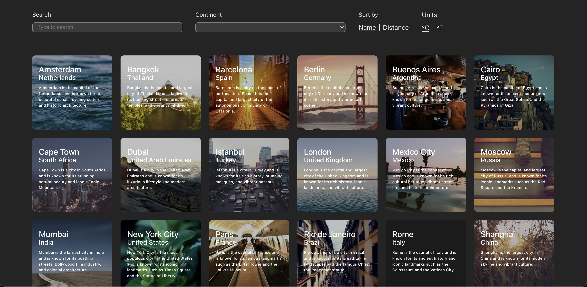

# 🌍 Weather App

Weather App is a React + TypeScript app that displays a grid of active cities with weather and filtering features.

---

## 📸 Preview



---

## ✨ Features

- Grid view of active cities
- Search by city or country name
- Filter by continent
- Sort by name or distance from Tel Aviv
- Temperature unit toggle: °C / °F
- City details page with current weather & forecast
- Responsive layout (desktop/mobile)
- Data persistence using URL (search, filters, etc.)

---

## 🛠️ Technologies

- React (with Vite)
- TypeScript
- React Router v6
- CSS (vanilla)
- OpenWeatherMap API
- Material UI
- Framer Motion Library
- Responsive design with CSS Grid

---

## 🧠 State & Logic

- **URL-based filter**:
  - Filtering is handled via URL params
  - URL is persistent when user toggle pages

---

## ✨ UX/UI

- Loading cards animation
- Micro interaction - card scale on hover
- UI display results error on no data
- On filtering, cards use exit animation
- Error message is delayed until exit animation finish

---

# 🧭 UX Interaction Flow

1. User clicks on a card
2. User is moved to city details page with current props
3. User can either:
   - Filter
   - Select via continent
   - Sort via distance
   - Toggle units (will be displayed on city details page)
4. On City Details Page user can see relevant data or click back

---

## 🚀 Getting Started

1. **Clone the repo**  
   ```bash
   git clone https://github.com/GNGscr/weather-app.git
   cd weather-app

2. **Install dependencies**  

  npm install

3. **Add your OpenWeather API key**  

  Create a .env file in the root and add:
  VITE_WEATHER_API_KEY=your_api_key_here

4. **Start the dev server**

  npm run dev

## 📦 Build for production

  npm run build

## 🧪 Testing

  No tests were implemented due to time constraints. The code is modular and ready for testing.


## 👨‍💻 Author

  Built by Daniel Ehrlich as side project.# weather-app
